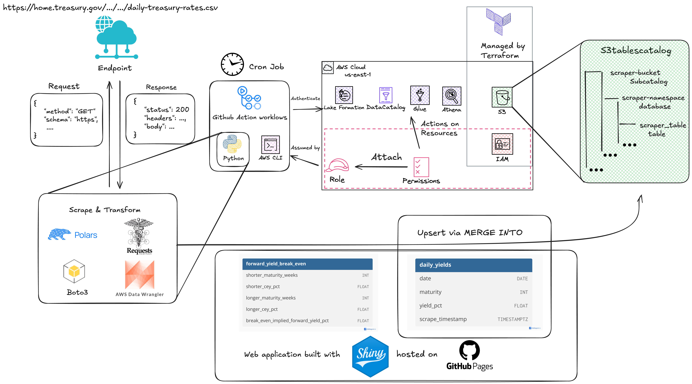

# Treasury Bills Scraper

This is a Python 3 based pipeline that scrapes daily Treasury bill rates and provides interactive visualization through a web application.

**🌐 [View Live Web App](https://yangwu1227.github.io/tbills-scraper/)**

- Yield curve
- Yield spread
- Break-even implied forward yield

## Architecture

This project automates the collection, processing, and analysis of U.S. Treasury bill data from [treasury.gov](https://home.treasury.gov/resource-center/data-chart-center/interest-rates/TextView?type=daily_treasury_bill_rates). It provides break-even yield calculations and interactive visualizations through a [Shinylive](https://shiny.posit.co/py/get-started/shinylive.html) for Python web application. The project architecture can be visualized as follows:

  
  

    Diagram created with <a href="https://excalidraw.com/" target="_blank">Excalidraw</a>
  

### Core Components

- 🔄 **Data Ingestion**: Automated scraping using `requests` and `polars`
- 🗄️ **Storage**: AWS S3 Table Buckets with the Apache Iceberg open table format
- 📊 **Analytics**: AWS Athena for SQL-based data processing
- ⚙️ **Orchestration**: GitHub Actions for CI/CD and scheduled data updates
- 🏗️ **Infrastructure**: Terraform for AWS resource management
- 🌐 **Web App**: Shiny for Python with interactive visualizations
- 🚀 **Deployment**: GitHub Pages for static web hosting

## Documentation

- [S3 Table Bucket](terraform/docs/s3_table_bucket.md)
- [Github Actions OpenID Connect](terraform/docs/github_action_oidc.md)
