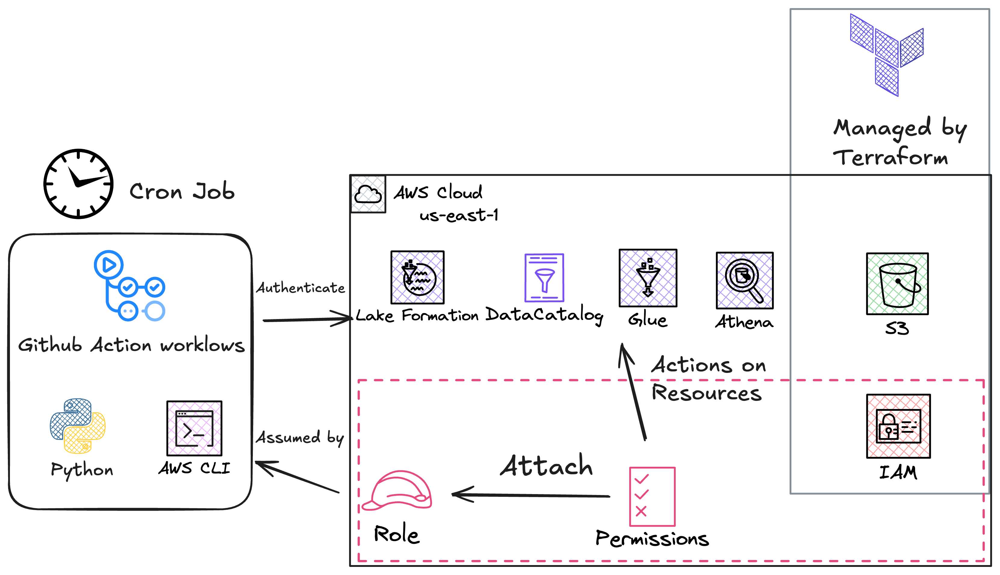

# GitHub Actions OIDC

GitHub Actions is a CI/CD service that allows us to automate workflows directly in our GitHub repository. In this project, we use workflows to do various tasks:

- `terraform_validate_plan_apply.yml` and `terraform_s3_table_bucket.yml` (AWS): These workflows deploy the S3 Table Bucket and its associated resources.

- `scrape_data.yml` (AWS): This workflow is responsible for scraping the Treasury bill data.

- `deploy_app.yml`: This workflow deploys the Shinylive web application.

Two of these workflows interact with AWS services, which requires us to configure an [OpenID Connect](https://openid.net/developers/how-connect-works/) (OIDC) provider. This provider enables GitHub Actions to authenticate with AWS using OIDC tokens, enhancing security by removing the need for long-lived AWS credentials stored as secrets in the GitHub repository.

For additional details, refer to the following resources:

- [Configuring OpenID Connect in Amazon Web Services](https://docs.github.com/en/actions/security-for-github-actions/security-hardening-your-deployments/configuring-openid-connect-in-amazon-web-services)

- [GitHub Actions: Update on OIDC integration with AWS](https://github.blog/changelog/2023-06-27-github-actions-update-on-oidc-integration-with-aws/)

---

## Workflows

This project uses four GitHub Actions workflows for different automation tasks:

### Infrastructure Workflows

#### `terraform_validate_plan_apply.yml` & `terraform_s3_table_bucket.yml`

The workflow `terraform_validate_plan_apply.yml` implements a **reusable workflow pattern** that provides several architectural benefits:

1. **DRY Principle**: Eliminates code duplication across multiple Terraform deployments
2. **Consistency**: Ensures standardized validation, planning, and apply processes (`terraform validate`, `terraform plan`, `terraform apply`)
3. **Scalability**: Easy to add new Terraform modules without workflow duplication (e.g., if we need to deploy other AWS resources)

This workflow is then used by `terraform_s3_table_bucket.yml` to deploy an S3 Table bucket.

**Required Environment Variables:**

- `AWS_REGION`: AWS region for resource deployment
- `AWS_GITHUB_ACTIONS_ROLE_ARN`: IAM role ARN for GitHub Actions authentication

#### `scrape_data.yml`

This workflow handles the daily Treasury bill data scraping and processing.

**Required Environment Variables:**

- `AWS_REGION`: AWS region for resource deployment
- `AWS_GITHUB_ACTIONS_ROLE_ARN`: IAM role ARN for GitHub Actions authentication
- `ATHENA_WORKGROUP`: Athena workgroup for query execution
- `ATHENA_OUTPUT_S3`: S3 location for Athena query results
- `DATABASE`: Glue catalog database name
- `SUBCATALOG`: S3 Tables subcatalog name
- `TABLE_NAME`: Target table name for data upserts
- `SLACK_WEBHOOK`: Webhook URL for Slack notifications
- `SLACK_CHANNEL`: Slack channel for notifications

### Application Workflow

#### `deploy_app.yml`

This workflow deploys the Shinylive web application to GitHub Pages.

**Required Environment Variables:**

- None (uses GitHub's built-in `GITHUB_TOKEN`)

---

## Marketplace Actions and Design Patterns

We leverage several GitHub Marketplace actions to enhance security, reliability, and functionality:

### AWS Integration

- **`aws-actions/configure-aws-credentials@v4`**: Securely authenticates with AWS using OIDC tokens, eliminating the need for long-lived credentials
- **Purpose**: Enables temporary, session-based access to AWS services for infrastructure deployment and data operations

### Development Tools

- **`actions/checkout@v4`**: Retrieves repository code with configurable fetch depth
- **`actions/setup-python@v5`**: Sets up Python runtime environment with version pinning
- **`astral-sh/setup-uv@v6`**: Configures UV dependency management
- **`hashicorp/setup-terraform@v3`**: Installs and configures Terraform with version consistency

### Artifact Management

- **`actions/upload-artifact@v4`** & **`actions/download-artifact@v4`**: Share Terraform state and plans between workflow jobs
- **Purpose**: Ensures plan consistency between validation and apply phases

### Notifications & Git Operations

- **`rtCamp/action-slack-notify@v2`**: Sends structured notifications to Slack channels with data scraper job status
- **`stefanzweifel/git-auto-commit-action@v6`**: Automatically commits scraped data files back to the repository
- **`actions/github-script@v7`**: Updates pull request comments with Terraform plan outputs for review
