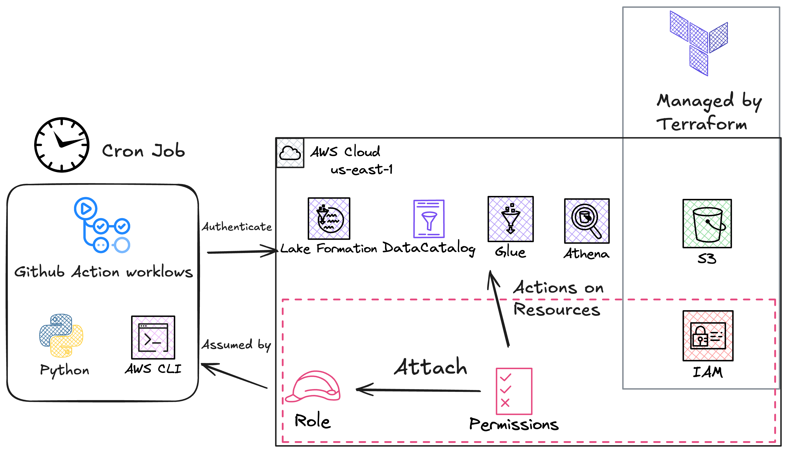

# GitHub Actions OIDC

GitHub Actions is a CI/CD service that allows us to automate workflows directly in our GitHub repository. In this project, we use workflows to do various tasks:

- `terraform_validate_plan_apply.yml` and `terraform_s3_table_bucket.yml` (AWS): These workflows deploy the S3 Table Bucket and its associated resources.

- `scrape_data.yml` (AWS): This workflow is responsible for scraping the Treasury bill data.

- `deploy_app.yml`: This workflow deploys the Shinylive web application.

Two of these workflows interact with AWS services, which requires us to configure an [OpenID Connect](https://openid.net/developers/how-connect-works/) (OIDC) provider. This provider enables GitHub Actions to authenticate with AWS using OIDC tokens, enhancing security by removing the need for long-lived AWS credentials stored as secrets in the GitHub repository.

For additional details, refer to the following resources:

- [Configuring OpenID Connect in Amazon Web Services](https://docs.github.com/en/actions/security-for-github-actions/security-hardening-your-deployments/configuring-openid-connect-in-amazon-web-services)

- [GitHub Actions: Update on OIDC integration with AWS](https://github.blog/changelog/2023-06-27-github-actions-update-on-oidc-integration-with-aws/)

<center>

</center>

---

## Workflows

This project uses four GitHub Actions workflows for different automation tasks:

### Infrastructure Workflows

#### `terraform_validate_plan_apply.yml` & `terraform_s3_table_bucket.yml`

The workflow `terraform_validate_plan_apply.yml` implements a **reusable workflow pattern** that provides several architectural benefits:

1. **DRY Principle**: Eliminates code duplication across multiple Terraform deployments
2. **Consistency**: Ensures standardized validation, planning, and apply processes (`terraform validate`, `terraform plan`, `terraform apply`)
3. **Scalability**: Easy to add new Terraform modules without workflow duplication (e.g., if we need to deploy other AWS resources)

This workflow is then used by `terraform_s3_table_bucket.yml` to deploy an S3 Table bucket.

**Required Environment Variables:**

- `AWS_REGION`: AWS region for resource deployment
- `AWS_GITHUB_ACTIONS_ROLE_ARN`: IAM role ARN for GitHub Actions authentication

#### `scrape_deploy_app.yml`

This workflow handles the daily Treasury bill data scraping and processing, followed by deploying the Shinylive web application.

**Required Environment Variables:**

- `AWS_REGION`: AWS region for resource deployment
- `AWS_GITHUB_ACTIONS_ROLE_ARN`: IAM role ARN for GitHub Actions authentication
- `ATHENA_WORKGROUP`: Athena workgroup for query execution
- `ATHENA_OUTPUT_S3`: S3 location for Athena query results
- `DATABASE`: Glue catalog database name
- `SUBCATALOG`: S3 Tables subcatalog name
- `TABLE_NAME`: Target table name for data upserts
- `SLACK_WEBHOOK`: Webhook URL for Slack notifications
- `SLACK_CHANNEL`: Slack channel for notifications

---

## Marketplace Actions

We leverage several GitHub Marketplace actions to enhance security, reliability, and functionality:

### AWS Integration

- **`aws-actions/configure-aws-credentials@v4`**: Securely authenticates with AWS using OIDC tokens, eliminating the need for long-lived credentials
- **Purpose**: Enables temporary, session-based access to AWS services for infrastructure deployment and data operations

### Development Tools

- **`actions/checkout@v4`**: Retrieves repository code with configurable fetch depth
- **`actions/setup-python@v5`**: Sets up Python runtime environment with version pinning
- **`astral-sh/setup-uv@v6`**: Configures UV dependency management
- **`hashicorp/setup-terraform@v3`**: Installs and configures Terraform with version consistency

### Artifact Management

- **`actions/upload-artifact@v4`** & **`actions/download-artifact@v4`**: Share Terraform state and plans between workflow jobs
- **Purpose**: Ensures plan consistency between validation and apply phases

### Notifications & Git Operations

- **`rtCamp/action-slack-notify@v2`**: Sends structured notifications to Slack channels with data scraper job status
- **`stefanzweifel/git-auto-commit-action@v6`**: Automatically commits scraped data files back to the repository
- **`actions/github-script@v7`**: Updates pull request comments with Terraform plan outputs for review

### GitHub Pages Deployment

- **`actions/configure-pages@v5`**: Configures Github Pages settings and prepares the deployment environment
- **`actions/upload-pages-artifact@v3`**: Packages static content from the `./docs` directory for Github Pages deployment
- **`actions/deploy-pages@v4`**: Deploys the uploaded artifact to Github Pages using the official deployment action
- **Purpose**: Enables automated deployment of Shinylive applications and static documentation to Github Pages using [custom workflows](https://docs.github.com/en/pages/getting-started-with-github-pages/using-custom-workflows-with-github-pages), providing a streamlined CI/CD pipeline for web

---

## Design Patterns

### Reusable Terraform Workflow

The project implements a **reusable workflow pattern** for Terraform deployments, separating the workflow logic from the specific infrastructure being deployed. This pattern follows the **template method** design pattern, where the core deployment process is standardized while allowing customization through input parameters.

#### Architecture

```shell
terraform_validate_plan_apply.yml (Reusable Template)
├── Input: root_path parameter
├── Secrets: AWS credentials
└── Standard steps: fmt -> validate -> plan -> apply

terraform_s3_table_bucket.yml (Consumer)
├── Triggers: path-based + manual
├── Calls: terraform_validate_plan_apply.yml
└── Context: root_path: 'terraform/s3_table_bucket'
```

#### Key Designs

**1. Separation of Concerns**

- **Template workflow** (`terraform_validate_plan_apply.yml`): Contains the deployment logic
- **Consumer workflow** (`terraform_s3_table_bucket.yml`): Defines triggers and context

**2. Path-Based Triggering**

The consumer workflow uses path filtering to minimize unnecessary executions:

```shell
paths:
  - 'terraform/s3_table_bucket/**'      # Infrastructure changes
  - '.github/workflows/*.yml'           # Workflow changes
```

**3. Artifact-Based State Management**

The workflow splits into two jobs (`terraform-fmt-validate-plan` and `terraform-apply`) with artifact passing:

- **Terraform state artifacts**: Preserves `.terraform/` directory and lock files between jobs

- **Plan artifacts**: Ensures the exact plan validated in PR is applied on merge

- **Retention policy**: 1-day retention minimizes storage costs while maintaining job reliability

**4. Branch-Based Execution Strategy**

- **Pull requests**: Execute `format`, `validate`, and `plan` (with PR comments) (without `apply`)

- **Main branch**: Execute full pipeline including `apply`

- **Conditional apply**: `if: github.ref == 'refs/heads/main'` prevents accidental deployments on non-main branches

### Scrape & Deploy Workflow

The `scrape_deploy_app.yml` workflow implements a **sequential job dependency pattern** that chains data scraping with application deployment, using conditional execution to optimize resource usage.

#### Architecture

```shell
scrape_deploy_app.yml
├── Job 1: scrape (Always runs)
│   ├── Data scraping & AWS operations
│   ├── Conditional commit (main branch only)
│   └── Outputs: did_commit, commit_sha
│
└── Job 2: deploy (Conditional)
    ├── Depends: scrape success + did_commit == 'true'
    ├── Checkout: exact commit from scrape job
    └── Export & commit Shinylive app
```

#### Key Designs

**1. Outputs Conditions**

The [git-auto-commit](https://github.com/stefanzweifel/git-auto-commit-action) action has [outputs](https://github.com/stefanzweifel/git-auto-commit-action?tab=readme-ov-file#outputs) that can be used to control job execution flow.

```shell
outputs:
  did_commit: ${{ steps.commit-data.outputs.changes_detected }}
  commit_sha: ${{ steps.commit-data.outputs.commit_hash }}

needs: scrape
if: ${{ success() && needs.scrape.outputs.did_commit == 'true' }}
```

The deploy job only executes when scrape succeeds *AND* data was actually committed, preventing unnecessary deployments, especially when data did not change.

**2. Branch-Aware Commit Strategy**

```shell
if: github.ref == 'refs/heads/main' && github.event_name != 'pull_request'
```

Data commits only occur on main branch pushes, while PR events perform validation of the python codewithout persistence.

**3. Scheduling**

```shell
schedule:
  - cron: '0 22 * * 1-5'  # 10 PM UTC weekdays = 5 PM EST
```

Triggers the job after Treasury data publication on each day (~ 3:30 PM EST daily), with a buffer of 1 hour and 30 minutes.

**4. Atomic Commit Consistency**

The `deploy` job checks out the exact commit created by the scrape job:

```shell
ref: ${{ needs.scrape.outputs.commit_sha || github.sha }}
```

This ensures the Shinylive export uses the precise data version that was scraped.

All the above designs are aimed at achieving:

**Resource efficiency**: Deploy job only runs when new data are committed, avoiding redundant Shinylive exports and Github Pages deployments.

**Data consistency**: Sequential job pattern ensures the web application always reflects the latest scraped data.

**Failure isolation**: Independent Slack notifications for scrape status allow monitoring of data pipeline health regardless of deployment
