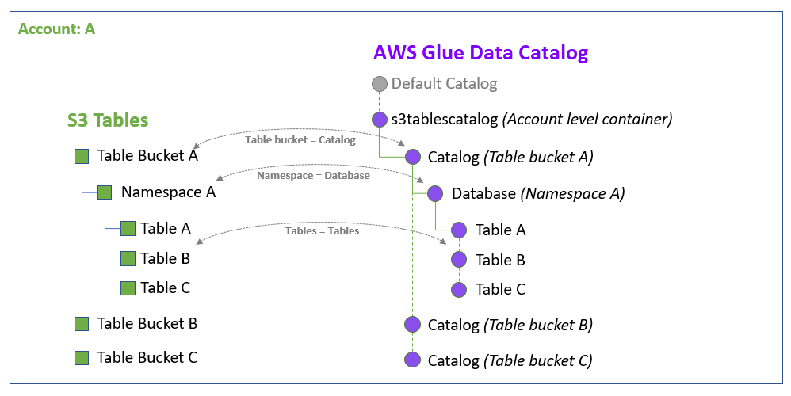
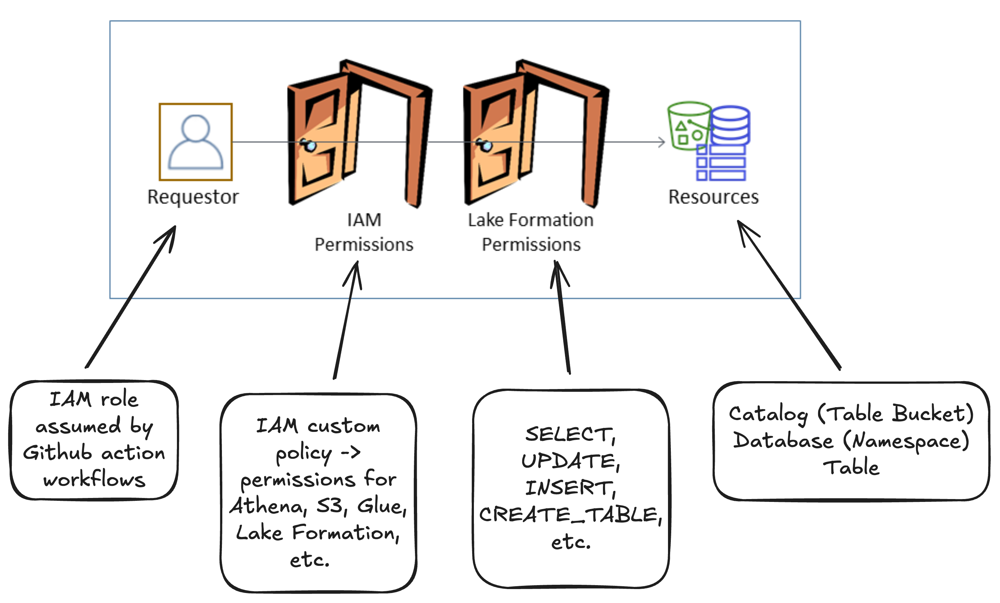

# S3 Table Bucket

## Core Components

Amazon S3 Tables has three main components:

- [**Table Bucket**](https://docs.aws.amazon.com/AmazonS3/latest/userguide/s3-tables-buckets.html): An S3 bucket type optimized for tabular data and metadata as objects for use in analytics workloads.

- [**Namespace**](https://docs.aws.amazon.com/AmazonS3/latest/userguide/s3-tables-namespace.html): Logical grouping within a table bucket, e.g., all tables related to a specific department could be grouped under a common namespace.

- [**Table**](https://docs.aws.amazon.com/AmazonS3/latest/userguide/s3-tables-tables.html): A structured dataset that consists of the actual data as well as metadata. All tables in a table bucket are stored using the [Apache Iceberg](https://iceberg.apache.org/docs/latest/) open table format.

**Reference**

- [Working with Amazon S3 Tables and table buckets](https://docs.aws.amazon.com/AmazonS3/latest/userguide/s3-tables.html)

---

## Usage in Treasury Bills Scraper

The S3 Table Bucket is used to store Treasury bill data.

### Data Flow

1. **Data Ingestion**: The scraper fetches daily Treasury bill rates from [treasury.gov](https://home.treasury.gov/resource-center/data-chart-center/interest-rates/TextView?type=daily_treasury_bill_rates)

2. **Data Processing**: [Polars](https://pola.rs/) is used to transform the data into a long format

3. **Upsert Operations**: Data is merged into an Iceberg table using Athena's [MERGE INTO](https://docs.aws.amazon.com/athena/latest/ug/merge-into-statement.html) statement

4. **Analytics**: Break-even yield calculations are performed on the stored data

### Data Schema

The Iceberg table stores Treasury bill data with the following schema:

<center>

| Column | Type | Description |
|--------|------|-------------|
| `date` | DATE | Trading date |
| `maturity` | INT | Maturity in weeks (4, 6, 8, 13, 17, 26, 52) |
| `yield_pct` | FLOAT | Coupon-equivalent yield percentage |
| `scrape_timestamp` | TIMESTAMP | Data ingestion timestamp (UTC) |

</center>

Another output table is written to `app/data/` for display in the web application but not written to S3. This table reports the break-even implied forward yields for each pair of `Shorter Maturity` and `Longer Maturity`.

<center>

| Column | Type | Description |
|--------|------|-------------|
| `Shorter Maturity (weeks)` | INT | Shorter maturity in weeks (4, 6, 8, 13, 17, 26, 52) |
| `Shorter CEY (%)` | FLOAT | Shorter coupon-equivalent yield percentage |
| `Longer Maturity (weeks)` | INT | Longer maturity in weeks (4, 6, 8, 13, 17, 26, 52) |
| `Longer CEY (%)` | FLOAT | Longer coupon-equivalent yield percentage |
| `Break-Even Implied Forward Yield (%)` | FLOAT | Break-even implied forward yield percentage |

</center>

Details of the break-even implied forward yield can be found in `notebooks/break_even_cey.ipynb` and in the web application.

---

## Maintenance Configuration

S3 Tables provides two levels of maintenance operations to optimize storage and query performance:

| Maintenance Operation | Level | Property | Default | Range | Terraform Configuration |
|----------------------|-------|----------|---------|--------|------------------------|
| **Unreferenced File Removal** | Bucket | `unreferenced_days` | 3 days | 1+ days | ✅ Configured |
| | | `non_current_days` | 10 days | 1+ days | ✅ Configured |
| **Compaction** | Table | `target_file_size_mb` | 512MB | 64-512MB | ✅ Configured |
| **Snapshot Management** | Table | `min_snapshots_to_keep` | 1 | 1+ | ✅ Configured |
| | | `max_snapshot_age_hours` | 120 hours | 1+ hours | ✅ Configured |

### Table Bucket Level Maintenance

**Unreferenced file removal** automatically cleans up orphaned objects not referenced by any table snapshots. This operates in two phases:

1. Objects older than `unreferenced_days` are marked as noncurrent
2. Noncurrent objects are permanently deleted after `non_current_days`

The module configures:

```python
locals {
  bucket_maintenance_configuration = {
    iceberg_unreferenced_file_removal = {
      status = var.enable_unreferenced_file_removal ? "enabled" : "disabled"
      settings = {
        unreferenced_days = var.unreferenced_days
        non_current_days  = var.non_current_days
      }
    }
  }
}
```

**Design rationale**: Uses AWS defaults (3 days unreferenced, 10 days noncurrent) which provide a reasonable balance between storage cleanup and data safety for the Treasury bill dataset.

### Table Level Maintenance

#### Compaction

Combines smaller files into larger ones to improve query performance and applies row-level deletes. The module configures:

```python
locals {
  default_maintenance_configuration = {
    iceberg_compaction = {
      status = var.enable_compaction ? "enabled" : "disabled"
      settings = {
        target_file_size_mb = var.target_file_size_mb
      }
    }
    # ...
  }
}
```

**Design rationale**: 128MB target (vs. 512MB default) balances file size with the relatively small daily Treasury data volume, avoiding over-sized files that could impact query performance.

#### Snapshot Management

Controls retention of table snapshots to manage storage costs while preserving data lineage:

```python
locals {
  default_maintenance_configuration = {
    # ...
    iceberg_snapshot_management = {
      status = var.enable_snapshot_management ? "enabled" : "disabled"
      settings = {
        min_snapshots_to_keep  = var.min_snapshots_to_keep
        max_snapshot_age_hours = var.max_snapshot_age_hours
      }
    }
  }
}
```

**Design rationale**:

- **3 minimum snapshots**: Provides safety buffer for recovery while limiting storage
- **168 hours (7 days) maximum age**: Weekly Treasury bill cycles

Both configurations are applied via the table resource's `maintenance_configuration` block.

**Reference**

- [S3 Tables maintenance](https://docs.aws.amazon.com/AmazonS3/latest/userguide/s3-tables-maintenance-overview.html)

---

## Encryption

The project uses the default encryption with Amazon S3 managed keys (SSE-S3). This provides AES-256 encryption at no additional cost and is applied to all tables unless otherwise specified.

**Reference**

- [Protecting S3 table data with encryption](https://docs.aws.amazon.com/AmazonS3/latest/userguide/s3-tables-encryption.html)

---

## Access Management for S3 Table Bucket Resources

S3 Table Buckets use a dual-layer permissions model that combines IAM-based with resource-based guardrails. Both layers must allow an action for it to succeed.

### Dual Permission Requirements

When a request is made to perform an action on S3 Tables resources (e.g., during Terraform apply when the Github Actions IAM role tries to `Create*`, `Put*`, or `Delete*`, etc.), both permission layers are checked:

1. **IAM Permissions**: The IAM principal must have the necessary S3 Tables permissions
2. **Resource-Level Guardrails**: The action must be explicitly allowed in the table bucket, namespace, or table policy

### Current Implementation in the Project

#### IAM Role Permissions

The Github Actions role uses the AWS managed policy `AmazonS3TablesFullAccess`, which grants:

```json
{
  "Version": "2012-10-17",
  "Statement": [
    {
      "Effect": "Allow",
      "Action": "s3tables:*",
      "Resource": "*"
    }
  ]
}
```

#### Resource-Level Guardrails

The table bucket policy explicitly allows specific actions via the `table_bucket_policy_actions` variable, which currently matches all actions included in the managed policy:

```python
variable "table_bucket_policy_actions" {
  description = "List of actions for the table bucket policy - grants all necessary permissions"
  type        = list(string)
  default     = [
    # Table bucket management
    "s3tables:CreateTableBucket",
    "s3tables:GetTableBucket",
    # ...
  ]
}
```

- **Synchronization requirement**: If the `table_bucket_policy_actions` list is modified to be a subset of `s3tables:*`, any removed actions would be blocked even if the IAM role has `AmazonS3TablesFullAccess`.

- **Granular control**: This dual-layer approach enables fine-grained access control. We can restrict specific operations at the resource level while maintaining broad IAM permissions for roles (which may need more permissions elsewhere).

**References**

- [AmazonS3TablesFullAccess managed policy](https://docs.aws.amazon.com/aws-managed-policy/latest/reference/AmazonS3TablesFullAccess.html)

- [Actions for S3 Tables](https://docs.aws.amazon.com/AmazonS3/latest/userguide/s3-tables-setting-up.html#s3-tables-actions)

- [IAM identity-based policies for S3 Tables](https://docs.aws.amazon.com/AmazonS3/latest/userguide/s3-tables-identity-based-policies.html)

- [Resource-based policies for S3 Tables](https://docs.aws.amazon.com/AmazonS3/latest/userguide/s3-tables-resource-based-policies.html)

---

## Lake Formation Integration

### Overview

To make S3 Tables accessible by AWS analytics services like Athena, we need to integrate S3 Table buckets with [Lake Formation](https://docs.aws.amazon.com/lake-formation/latest/dg/what-is-lake-formation.html). This integration creates an AWS Glue data catalog specifically for S3 Table buckets.

<center>

</center>

S3 Table bucket components are mapped to AWS Glue catalog components as follows:

- **Table Bucket** → (Sub)catalog
- **Namespace** → Database
- **Table** → Table

**Reference**

- [Amazon S3 Tables integration with AWS analytics services overview](https://docs.aws.amazon.com/AmazonS3/latest/userguide/s3-tables-integration-overview.html)

### Integration Scripts

Two helper scripts for Lake Formation integration and permission management:

#### `scripts/integrate_s3tables_lake_formation.sh`

Sets up the integration between S3 Table buckets and Lake Formation:

1. Create a service role for Lake Formation to access all S3 Table buckets

2. Register S3 Table buckets with Lake Formation, which allows Lake Formation to manage access, permissions, and governance for all current and future table buckets in the region

3. Create a Glue Data Catalog called `s3tablescatalog`, which allows all table buckets, namespaces, and tables to be populated in this catalog

**Reference**

- [Integrating Amazon S3 Tables with AWS analytics services](https://docs.aws.amazon.com/AmazonS3/latest/userguide/s3-tables-integrating-aws.html)

#### `scripts/grant_s3tables_permissions.sh`

Grants Lake Formation permissions to a specific IAM principal (user or role) for accessing S3 Table buckets in the data catalog. In this project, we use an IAM role that can only be assumed by Github Action workflows; the scraping process runs within the workflow.

In order for this IAM role to access data pointed to by the data catalog, it must pass permission checks by both IAM and Lake Formation.

1. **IAM Permissions**: The IAM role itself must have the necessary permissions to perform actions on required AWS resources: S3, Lake Formation, Glue, Athena, S3Tables, DynamoDB (Terraform remote state management)

2. **Lake Formation Permissions**: On the Lake Formation side, we must grant this IAM role Lake Formation permissions on the table or database resources it needs to access. **Note:** The script implements table-level permission grants, which is more granular than database-level grants.

The Lake Formation permissions model is a combination of Lake Formation and IAM permissions:

<center>

</center>

**References**

- [Overview of Lake Formation permissions](https://docs.aws.amazon.com/lake-formation/latest/dg/lf-permissions-overview.html)
- [GrantPermissions](https://docs.aws.amazon.com/lake-formation/latest/APIReference/API_GrantPermissions.html)
- [Managing access to a table or database with Lake Formation](https://docs.aws.amazon.com/AmazonS3/latest/userguide/grant-permissions-tables.html)

---

## ⚠️ Critical Distinction

> **IMPORTANT:** There are two different types of permissions required for S3 Tables:
>
> ### S3 Tables Resource Management Permissions
>
> These control **managing** S3 Tables resources themselves (infrastructure operations):
>
> - Creating, getting, deleting S3 table buckets
> - Creating, getting, deleting namespaces and tables  
> - Managing resource-level policies
> - **Configured via:** IAM policies + S3 Tables resource-based policies (dual-layer model)
> - **Used for:** Terraform operations, infrastructure management
>
> ### Lake Formation Data Access Permissions  
>
> These control **accessing the underlying data** stored in S3 Tables resources:
>
> - Reading/writing actual table data through analytics services (Athena, etc.)
> - Querying data via the Glue Data Catalog
> - **Configured via:** IAM policies + Lake Formation permissions (also dual-layer model)
> - **Used for:** Data analytics, queries, ETL operations
>
> **Both permission layers are required but serve completely different purposes.** The GitHub Actions role needs S3 Tables resource management permissions to deploy infrastructure via Terraform, *AND* Lake Formation data access permissions to read/write actual Treasury bill data during scraping.
